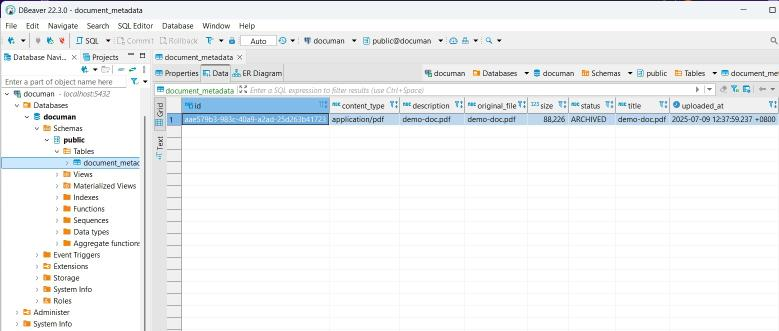
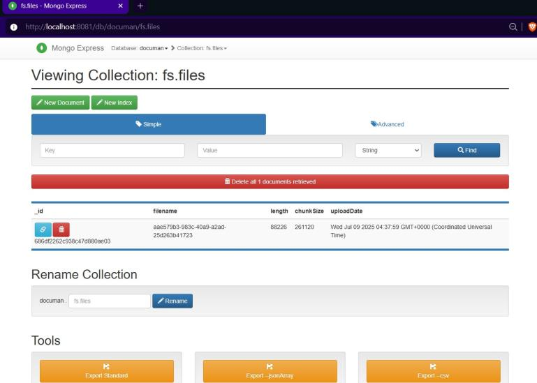
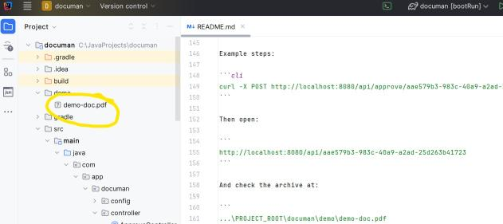

### Overview of the 'Documan' App

With the Documan app, you can upload various document files (*PDF, images, etc.*) to the database.

- The document content is stored in MongoDB as binary data.
- The document's metadata is stored in a PostgreSQL database.

The app lets you perform the following actions with uploaded documents:

- View metadata for a specific document by its ID, or list all documents
- Download a document file
- Delete a document by ID
- Approve and archive documents to a predefined SMB storage

---

### Used Framework and Tools

- Java 17
- Spring Boot v 3.2.5- Spring Web, Spring Data JPA, Spring Data MongoDB 
- PostgreSQL
- MongoDB
- RabbitMQ
- Lombok
- Gradle
- Docker, Docker Compose
- and Git for version control

---

### Running Documan Locally

To run the app locally:

1. Start the required services (Postgres, RabbitMQ, MongoDB, SMB server and Mongo-Express to view the Mongo DB contents) using Docker compose:  
   run the following command in the root directory of the project:
   ```
   docker compose up -d
   ```

2. Run the application:
    - directly in IntelliJ by running `DocuManApplication.java`
    - or with Gradle:
        ```
        .\gradlew.bat bootRun  (on Windows)
        ```
      
        ```
        .\gradlew bootRun  (on Linux)
        ```

3. Open your browser and visit:

    - [http://localhost:8080](http://localhost:8080) to open REST API Documentation/Swagger UI
    - or [http://localhost:8080/actuator/health](http://localhost:8080/actuator/health) to check if it’s running

4. Use the API with sample data.

You can test the API using:
- the `curl` command in the terminal 
- or [Postman](https://www.postman.com/downloads/)
- or Swagger (OpenAPI) at http://localhost:8080/swagger-ui/index.html

---

### Testing the App

#### Upload a Document

1. Prepare a test file, e.g., at `C:/Temp/demo-doc.pdf` (on Windows).

2. Upload the document:

**Basic upload:**

```cli
curl http://localhost:8080/api/upload -F file=@C:/Temp/demo-doc.pdf
```

**With custom title and description:**

```cli
curl http://localhost:8080/api/upload `
  -F file=@C:/Temp/demo-doc.pdf `
  -F title=demo-title `
  -F description=demo-desc
```

You’ll get a response like this:

```json
{
  "id": "aae579b3-983c-40a9-a2ad-25d263b41723",
  "title": "demo-doc.pdf",
  "description": "demo-doc.pdf",
  "originalFilename": "demo-doc.pdf",
  "contentType": "application/pdf",
  "size": 88226,
  "uploadedAt": "2025-07-09T12:37:59.237385+08:00",
  "status": "NEW",
  "approved": false,
  "archived": false
}
```

Note the document ID (e.g. `aae579b3-983c-40a9-a2ad-25d263b41723`) for later steps.

---

#### Read All Documents

Visit:

```
http://localhost:8080/api
```

Or use:

```cli
curl http://localhost:8080/api
```

#### Read a Specific Document

Open the following URLin your browser to view the document:

```
http://localhost:8080/api/{id}
```
Replace `{id}` with your document ID:

Example:

```
http://localhost:8080/api/aae579b3-983c-40a9-a2ad-25d263b41723
```

Or run:

```cli
curl http://localhost:8080/api/aae579b3-983c-40a9-a2ad-25d263b41723
```

---

#### Approve a Document

Run:

```cli
curl -X POST http://localhost:8080/api/approve/{id}
```

Then:

1. Check the document status at:
   ```
   http://localhost:8080/api/{id}
   ```
2. Find the archived document in:
   ```
   ...\PROJECT_ROOT\documan\demo\YOUR-FILE
   ```

Example steps:

```cli
curl -X POST http://localhost:8080/api/approve/aae579b3-983c-40a9-a2ad-25d263b41723
```

Then open:

```
http://localhost:8080/api/aae579b3-983c-40a9-a2ad-25d263b41723
```

And check the archive at:

```
...\PROJECT_ROOT\documan\demo\demo-doc.pdf
```

---

### Connecting to Databases
You can check stored documents in DBs using DB clients like [DBeaver](https://dbeaver.io/) and [Mongo-Express](https://hub.docker.com/_/mongo-express). 

To connect to the DB use the following URLs and credentials:
- For PostgreSQL: URL `jdbc:postgresql://localhost:5432/documan` and username `admin` and password `admin`
- For MongoDB: URL `http://localhost:8081/` and username `admin` and password `admin`

**Demo doc in Postgres DB**:  




**Demo doc in MongoDB**:  




**Demo doc in the SMB archive**:  


